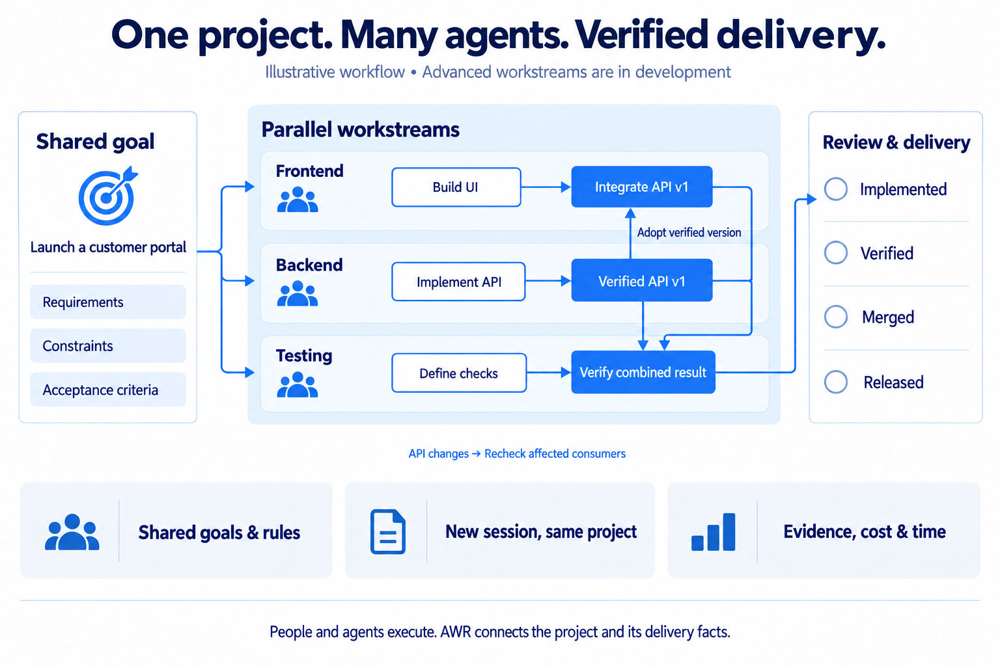

<div align="center">


# AWR

**Let your AI team keep complex projects moving—from goal to verified delivery.**

The open-source project delivery platform for people and AI.

[English](README.md) · [简体中文](README.zh-CN.md)

[](LICENSE) [](https://github.com/originoneai/awr/releases) [](https://www.npmjs.com/package/@originoneai/agent-work-runtime) [](https://pypi.org/project/agent-work-runtime/)

[](https://awr.originoneai.com/) [](#quickstart)

[Documentation](docs/TAKEOVER.md) · [Releases](https://github.com/originoneai/awr/releases) · [Report an issue](https://github.com/originoneai/awr/issues) · [Contribute](CONTRIBUTING.md)

</div>

---

AWR connects **goals, workstreams, dependencies, context and acceptance** into
one project delivery workflow. It is built for **one person coordinating several
agents, and teams delivering a shared project**—starting with complex software
projects.

Changing sessions, models or collaborators should preserve the project's goals,
constraints and verified progress. Parallel work should have clear ownership
and handoffs. At every stage, you should be able to tell **what is ready, what is
waiting, what has been verified, and where the effort went**.

People set direction and review outcomes; agents do the work. AWR connects their
work to the same project through **CLI/MCP**, with Team collaboration developing
on that foundation. The availability labels below distinguish the published
release from development on `main`.

## Why AWR

| Core value | What changes for your project | Availability |
| --- | --- | --- |
| **Keep the goal through every handoff** | Goals, shared rules, decisions and unfinished work stay connected. A successor receives the current task's required context and checkpoint, so the project can continue across sessions and agents. | **0.5.1** · [Continuity](docs/integrations/context-continuity.md) |
| **Run independent workstreams in one project** | Frontend, backend and testing keep their own tasks, context and ownership while sharing project constraints. Work ownership, session attribution and scoped context are supported; authenticated transport isolation and resource scheduling are still in development. | **0.5.1 foundation** · [Workstreams](docs/reference/workstreams.md) |
| **Depend on a verified delivery** | Bind downstream work to an accepted artifact and contract version. When that dependency changes, recheck affected consumers according to their adoption policy. | **In development** · [Delivery dependencies](docs/reference/workstreams.md#cross-workstream-dependencies) |
| **Know what “done” actually means** | Connect completion claims to version-bound evidence. Track implementation, verification, merge and release as separate facts; Team review adds explicit reviewer and approval records. | **0.5.1 evidence foundation**; [Team delivery review](https://github.com/originoneai/awr/blob/main/docs/integrations/pr-delivery-review.md) **in development** |
| **See what each outcome costs** | Attribute recorded usage and time to work and its owning workstream. Keep actual costs, API-equivalent estimates, unknowns and observation coverage distinct; count shared effort once. | **In development** · [Usage and time](https://github.com/originoneai/awr/blob/main/docs/reference/usage-time-observation.md) |

These capabilities belong to the same project model. A person coordinating
several agents can need the same dependency, review and accounting discipline as
a larger team. Workstream isolation concerns project state and supported
operations; physical process isolation depends on the execution host.

## See a project move from goal to delivery

**Illustrative workflow · advanced workstreams are in development.**
This example explains the collaboration model; it is not an executed benchmark.

<p align="center">
  
</p>

1. **Agree on the outcome.** Define a customer portal's requirements, shared
   constraints and acceptance criteria before splitting the work.
2. **Make progress in parallel.** One agent builds the UI, another implements
   the API, and a third prepares acceptance checks. Each workstream carries its
   relevant context and ownership.
3. **Join through a verified version.** UI work can proceed immediately;
   integration waits for an accepted API delivery, then adopts that exact
   version and its evidence.
4. **Continue through change.** A successor uses the current checkpoint and
   dependency records. A changed contract triggers checks for affected consumers;
   a fixed, accepted version remains bound unless revoked.
5. **Review the delivered result.** Inspect the combined result against its
   acceptance criteria, with separate implementation, verification, merge and
   release records.
6. **Account for the effort.** Associate observed usage and time with the work
   and outcome; show gaps explicitly when a host does not expose complete data.

## What you can use today

The published **0.5.1** CLI/MCP packages provide source-backed goals and tasks,
dependency navigation, focused context, session claims and checkpoints,
version-bound evidence, a [shared HTTP MCP service](docs/reference/mcp-service.md)
for multiple clients/projects, and Personal Workspace file exchange.

This release adds **source freshness inventories, content review records and
truthful checkpoint progress**, alongside parsing and client-integration fixes.
Its **personal workstream foundation** supports explicit source ownership,
session attribution and scoped context in a local SQLite project. It does not
provide an authenticated Team service or complete multi-client isolation.
See [what changed in 0.5.1](docs/release/0.5.1.md).

The optional [Inspector](tools/inspector/README.md) runs from this source checkout;
it is not bundled in npm/PyPI. It includes Chinese/English views, complete queue
pagination, source-aware refresh, and session/event panels.

**Development on `main`:** versioned cross-workstream delivery adoption, Team
collaboration/review, DEC policy extensions and workstream usage/time/ETA
accounting are outside this release. The
[release notes](https://github.com/originoneai/awr/releases/tag/v0.5.1) define the
published package boundary.

## Quickstart

### 1. Install AWR

Choose one package manager. Both install the native `awr` and `awr-mcp` commands.

```sh
npm install -g @originoneai/agent-work-runtime@0.5.1
```

Or, inside a Python virtual environment:

```sh
python -m pip install agent-work-runtime==0.5.1
```

```sh
awr --version
```

Prebuilt packages support **macOS 15+ (Apple Silicon and Intel)**,
**Linux x64/arm64 (glibc 2.39+)** and **Windows x64**. Launchers require
Node 22.14+ or Python 3.9+. See the
[0.5.1 installation and upgrade guide](https://github.com/originoneai/awr/blob/v0.5.1/docs/release/DISTRIBUTIONS.md).

**Upgrading from 0.5.0:** stop existing writers and keep a matching runtime/source
backup and old binaries first. The explicit source refresh migrates SQLite
schema 4 through 5 and 6 to 7. Older binaries cannot open schema 7; rollback needs
the matching pre-upgrade snapshot. See the [upgrade guide](docs/release/DISTRIBUTIONS.md#matched-upgrade-and-rollback-checklist).

### 2. Connect your project

Run these commands from your project directory. Replace the example goal with
the outcome you want to deliver.

```sh
awr init --goal "Deliver a customer portal with verified sign-in"
```

Review the proposed sources and mappings, then accept the same goal:

```sh
awr init --goal "Deliver a customer portal with verified sign-in" --accept
awr status
awr intake inspect
```

Initialization preserves existing project sources and proposes missing structure.
If intake reports `NeedsOrganization`, let your agent complete the goals, tasks
and acceptance criteria before starting implementation. See the
[project intake guide](docs/TAKEOVER.md) for custom fields and existing ledgers.

### 3. Give your agent the working agreement

With CLI access to the initialized project, give your agent this instruction:

> Use AWR to carry this project from its goal to verified delivery. Start by
> reading the goal, shared rules, dependencies and latest checkpoint. Break this
> request into work with clear acceptance criteria, ownership and next actions.
> Check an upstream result's version and evidence before using it. Keep
> implementation, verification, merge and release facts separate. Record available
> usage data and its gaps. Before stopping, save a checkpoint so the next agent
> can check current sources and continue. Use the installed version's supported
> capabilities and report any missing integration.

You can inspect progress at any time with `awr status`. For the explicit
claim → context → checkpoint workflow, see the
[session guide](docs/integrations/session-workflow.md).

<details>
<summary><strong>Connect through MCP instead</strong></summary>

After initialization, add an entry like this to your client's MCP configuration.
Use the client's documented configuration format and your project's absolute path.

```json
{
  "mcpServers": {
    "awr": {
      "command": "awr-mcp",
      "args": ["--project", "/absolute/path/to/your/project"]
    }
  }
}
```

Reconnect the client and confirm the project identity before making changes.
For multiple clients and projects, use the
[shared HTTP MCP service](docs/reference/mcp-service.md). See the
[MCP reference](crates/awr-mcp/README.md) for configuration and tool discovery.

</details>

## Architecture

<p align="center">
  
</p>

1. **Your files hold the intent.** Markdown/YAML describe goals, plans, work,
   constraints and decisions; AWR indexes them without silently replacing them.
2. **AWR maintains continuity.** Local state holds projections, sessions, claims,
   checkpoints and evidence. Context compilation runs locally and makes no model
   calls; revision checks protect writes from stale state.
3. **People and agents do the work.** CLI/MCP connects the facts to the chosen
   host. Agents bring their own models, tools and conversations; reviewed changes
   and progress return to the project.

AWR preserves **project continuity across finite context windows**. Native
compaction and the agent's private conversation remain host responsibilities;
recorded checkpoints do not reconstruct unrecorded history. See
[context continuity](docs/integrations/context-continuity.md).

## Agent ecosystem

Use the agent you already work with. **The common entry point is CLI/MCP**;
optional lifecycle adapters provide deeper integration where supported.

| Entry point | Documentation |
| --- | --- |
| Any CLI/MCP-capable agent, including Claude Code | [Generic session workflow](docs/integrations/session-workflow.md) |
| Codex | [Optional lifecycle adapter](docs/integrations/codex.md) |
| Cursor | [Client configuration](docs/integrations/cursor.md) |
| Kimi Code | [Host integration note](docs/integrations/kimi.md) |
| Grok Build | [Host integration note](docs/integrations/grok.md) |
| Application or custom harness | [Host contract](docs/reference/host-contract.md) |

Hook availability and activation depend on the host. A configuration file alone
does not prove an automatic checkpoint or handoff occurred.
[Integration layers and boundaries](docs/integrations/README.md).

## Put the context budget into the current task

AWR compiles focused project context locally, without an additional model call.
This gives the agent the relevant goals, rules, dependencies and evidence within
a budget, reducing the need to read every project source on each handoff.

On the [public, reproducible context benchmark](docs/benchmarks/README.md):

| Input material | Tokens | Reduction vs. reading all sources |
| --- | ---: | ---: |
| Complete Markdown/YAML corpus | 18,955 | — |
| Largest rendered task context | 4,998 | **73.6%** |
| Largest complete CLI JSON response | 12,748 | **32.7%** |

The sample contains **150 synthetic tasks**, with all **39 active tasks** checked
and **676/676 required facts** retained. Counts use `o200k_base` with a 5,000-token
context budget. The baseline is reading every source, not optimized retrieval.
JSON metadata adds overhead. These figures measure input material, **not total
model bills or answer quality**; chat history, model output and MCP framing are
excluded.

A separate [30-run workflow comparison](docs/benchmarks/workflow.md) reduced tool
calls by **18–27%** and returned text by **3.4–4.7%** while retaining the same
completion contracts. It does not measure real model-token or billing savings.
Context compilation measured **108 ms at p95** on one Apple M3 Max/macOS host
(30 calls after warmup), not a concurrency guarantee.

## Project updates

| Resource | What you will find |
| --- | --- |
| [Releases](https://github.com/originoneai/awr/releases) | Published changes, installation artifacts and upgrade notes. |
| [Issues](https://github.com/originoneai/awr/issues) | Bug reports, feature requests and design proposals. |
| [Pull requests](https://github.com/originoneai/awr/pulls) | Development and review; merged source may precede a package release. |
| [Official website](https://awr.originoneai.com/) | Product overview and usage entry points. |

## Contributors

Thanks to everyone who improves AWR through code, documentation, bug reports and
real project feedback. See the [contribution guide](CONTRIBUTING.md) to get started.

[](https://github.com/originoneai/awr/graphs/contributors)

## Community and support

- [Report a bug or suggest a feature](https://github.com/originoneai/awr/issues/new/choose).
- [Review or contribute a change](https://github.com/originoneai/awr/pulls).
- [Build from source and run checks](CONTRIBUTING.md).

When reporting a problem, include the AWR version, operating system, reproducible
steps and redacted output. Keep credentials and private project sources out of
public reports.

## License

AWR is licensed under [Apache License 2.0](LICENSE).
