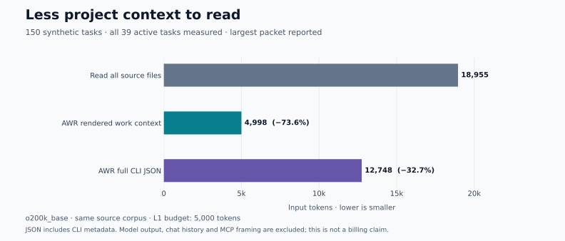

# AWR · Agent Work Runtime

[English](README.md) · [简体中文](README.zh-CN.md) · [Apache-2.0](LICENSE)

**Persistent project state and focused context for coding agents.**

A new chat should be able to find the current goal, unfinished work, constraints
and next action without rereading the entire project history. AWR indexes your
existing Markdown/YAML sources, records execution checkpoints and compiles a
bounded context packet for the task at hand. Use it through a native Rust CLI or
an MCP client. Context compilation runs locally and makes no model calls.

```text
Your project sources → AWR index + checkpoints → focused context → coding agent
       ↑                                                      │
       └──────── reviewed changes and recorded progress ───────┘
```

## What you gain

- **Less repeated reading.** Request one task's context, with required rules,
  acceptance criteria, blockers, dependencies and source references.
- **Continuity between sessions.** Persist checkpoints and open loops, then
  inspect what changed before resuming work.
- **An entry point for existing projects.** Preview discovered sources and
  mappings. Missing goals or task structure produce concrete organization steps
  for the coding agent to complete.
- **Sources you control.** Keep Markdown/YAML authoritative. AWR uses SQLite for
  projections and runtime state; revision checks reject stale writes.

## Measured example



On the [reproducible public benchmark](docs/benchmarks/README.md), reading all
sources costs **18,955 tokens**. The largest rendered work packet across **all 39
active tasks** costs **4,998 tokens: 73.6% less input**. Exact checks preserve
**676/676 required facts** across those tasks.

| What reaches the reader | Maximum tokens | Reduction vs. full-source read |
| --- | ---: | ---: |
| Full Markdown/YAML source corpus | 18,955 | — |
| AWR rendered work context | 4,998 | 73.6% |
| AWR complete CLI JSON response | 12,748 | 32.7% |

The sample has 150 synthetic tasks. Counts use `o200k_base`; context budget is
5,000. This compares against reading every source file, not another product or an
optimized search workflow. JSON metadata is larger than rendered context. These
numbers **do not establish model quality or end-to-end billing savings**; chat
history, model output and MCP framing are excluded.

On this Apple M3 Max / macOS run, context compilation took **108 ms at p95**
(30 sequential CLI calls after warmup). This is a single-host measurement.

## Get started

Install **0.3.1** through either registry; both supply `awr` and `awr-mcp`:

```sh
npm install -g @originoneai/agent-work-runtime@0.3.1
# or, in a Python virtual environment
python -m pip install agent-work-runtime==0.3.1
```

Prebuilt targets: macOS 15+ arm64 and Intel x64, Linux x64/glibc 2.39+, Windows x64.
Launchers require Node 22.14+ or Python 3.9+. See [distribution details](docs/release/DISTRIBUTIONS.md).
See the [0.3.1 release notes](docs/release/0.3.1.md) for host capabilities and schema upgrade guidance.

For an optional source build, use [Rust](https://www.rust-lang.org/tools/install)
(the repository pins its toolchain):

```sh
git clone https://github.com/originoneai/agent-work-runtime.git
cd agent-work-runtime
cargo install --locked --path crates/awr-cli
cargo install --locked --path crates/awr-mcp
```

Try a disposable example:

```sh
mkdir -p .local
cp -R examples/basic .local/demo
awr --project .local/demo init --manifest project.toml --accept
awr --project .local/demo status
awr --project .local/demo ready
awr --project .local/demo context compile --work EXAMPLE-001 --goal 'goal#demo'
```

The last command prints the rendered packet. Use `--json` for structured
integration; the budget applies to `work_context.rendered_context`, not the whole
JSON response. Check the command's exit status and completeness before acting.

For your own project, preview the mapping, then initialize it:

```sh
awr --project /path/to/project init
awr --project /path/to/project init --accept
awr --project /path/to/project intake inspect
```

If there is no clear goal, supply `--goal "Describe your intended outcome"` at
initialization. AWR diagnoses missing structure; your agent organizes the goal,
plan and task sources, then runs `intake inspect` again. It does not invent your
business intent. Nonstandard fields and statuses have explicit mappings such as
`--status-map pending=planned` and `--field-map title=事项`.

For MCP, configure the client to launch `awr-mcp --project /absolute/project/path`
after initialization. See the [MCP setup and eight tools](crates/awr-mcp/README.md),
[Codex guide](docs/integrations/codex.md),
[checkpoint/resume example](examples/codex/README.md) and
[project intake and execution guide](docs/TAKEOVER.md).

AWR can supervise commands it launches and bind supported client lifecycle events.
Restoring an arbitrary existing process or the private memory of a native client
requires that client's cooperation.

## Contribute

See [CONTRIBUTING.md](CONTRIBUTING.md) for build and test commands. Public examples
and synthetic fixtures are included; internal development plans, ledgers and raw
run records stay local. Licensed under [Apache-2.0](LICENSE).
