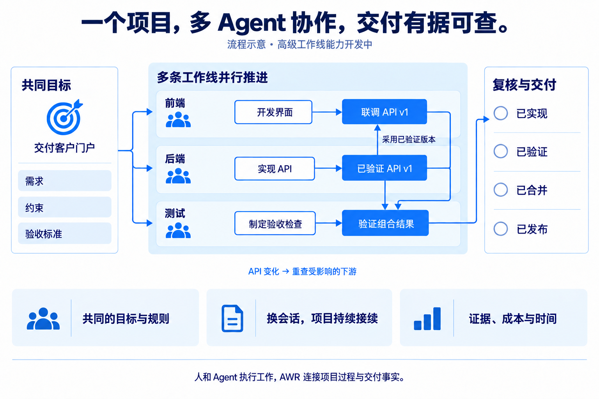

<div align="center">


# AWR

**让你的 AI 团队，把复杂项目持续做完。**

人与 AI 协作的开源项目交付平台。

[English](README.md) · [简体中文](README.zh-CN.md)

[](LICENSE) [](https://github.com/originoneai/awr/releases) [](https://www.npmjs.com/package/@originoneai/agent-work-runtime) [](https://pypi.org/project/agent-work-runtime/)

[](https://awr.originoneai.com/) [](#quickstart)

[使用文档](docs/TAKEOVER.md) · [版本发布](https://github.com/originoneai/awr/releases) · [问题反馈](https://github.com/originoneai/awr/issues) · [参与贡献](CONTRIBUTING.md)

</div>

---

AWR 围绕同一个项目目标，把**任务与工作线、交叉依赖、上下文和验收**组织到一条交付链路中。
它面向**一个人带多个 Agent，也面向多人共同交付一个项目**，首先聚焦复杂软件项目。

换了会话、模型或协作者，项目最初的目标、约束和已验证进度仍然有据可循；
多条工作线并行时，各自职责与交接条件保持明确。你始终应该能够看清：
**哪些能继续、哪些还在等待、哪些结果已经核验，以及投入花在了哪里。**

人决定方向并复核结果，Agent 执行工作。AWR 通过 **CLI/MCP** 把这些工作接入同一个项目，
并在此基础上推进 Team 协作。下方逐项标明已发布能力与 `main` 中的开发能力。

## 为什么使用 AWR

| 核心亮点 | 对项目的实际作用 | 当前状态 |
| --- | --- | --- |
| **换会话、换 Agent，项目目标持续有效** | 目标、共享规则、决策和未完成事项保持关联。接手者获得当前任务必需的上下文与检查点，沿着同一个项目继续推进。 | **0.5.1 已发布** · [工作接续](docs/integrations/context-continuity.md) |
| **多条工作线独立推进，共同交付** | 前端、后端、测试分别维护任务、上下文与归属，同时遵守共享约束；支持任务归属、会话归属和按工作线组织上下文；带身份鉴权的通道隔离与资源调度仍在开发中。 | **0.5.1 提供基础能力** · [工作线机制](docs/reference/workstreams.md) |
| **依赖的是已验证交付物与具体版本** | 下游采用的是经过验收的产物和合同版本。依赖发生变化时，按照采用策略重新检查受影响的下游。 | **开发中** · [交叉依赖](docs/reference/workstreams.md#cross-workstream-dependencies) |
| **“完成”有可核对的交付依据** | 完成声明关联版本与证据，分清已实现、已验证、已合并、已发布；Team 复核进一步记录实际复核者与批准结果。 | **0.5.1 已有证据基础**；[Team 交付复核](https://github.com/originoneai/awr/blob/main/docs/integrations/pr-delivery-review.md)**开发中** |
| **每一份投入，都能对应到工作与结果** | 将已采集的用量和时间归属到任务与工作线；区分实际费用、API 等价估算、未知项和采集覆盖率，共享投入只核算一次。 | **开发中** · [用量与时间](https://github.com/originoneai/awr/blob/main/docs/reference/usage-time-observation.md) |

这些能力围绕同一个项目模型组织。一个人协调多个 Agent，同样需要清晰的依赖、复核和核算。
工作线隔离覆盖项目状态与已支持的操作；进程层面的物理隔离由执行宿主提供。

## 看一个项目怎样协作交付

**协作流程示意 · 高级工作线能力开发中。** 以下用客户门户项目解释协作方式，属于示意案例。

<p align="center">
  
</p>

1. **先对齐要交付什么。** 明确客户门户的需求、共享约束与验收标准，再拆分工作。
2. **能够并行的先推进。** 一个 Agent 开发界面，一个实现 API，另一个准备验收检查；
   每条工作线维护各自的相关上下文与归属。
3. **在具体交付版本上衔接。** 界面开发先行，联调明确等待已验收的 API，
   再采用这一版本及其验证证据。
4. **换人、换会话、改接口，都有接续依据。** 接手者读取当前检查点与依赖记录；
   合同变化时检查受影响的下游，固定采用的已验收版本在未撤销时继续保留绑定。
5. **对照验收标准复核结果。** 检查组合后的实际产物，分别记录实现、验证、合并和发布事实。
6. **核对投入与产出。** 已观测到的用量和时间关联到任务及结果；宿主没有提供完整数据时，明确展示缺口。

## 现在可以使用什么

已发布的 **0.5.1** CLI/MCP 安装包提供有来源的目标与任务、依赖导航、聚焦上下文、
会话认领与检查点、绑定版本的证据，以及支持多个客户端和项目的
[共享 HTTP MCP 服务](docs/reference/mcp-service.md)与 Personal Workspace 文件交换。

这一版新增**统一来源文件清单、内容评审记录与可信的检查点进度展示**，并修复解析和客户端接入问题。
**个人多主线基础**支持在本地 SQLite 项目中显式声明任务归属、记录会话归属，并按工作线组织上下文。
它尚不提供带身份鉴权的 Team 服务或完整的多客户端隔离。详见 [0.5.1 变更说明](docs/release/0.5.1.md)。

可选的 [Inspector 查看界面](https://github.com/originoneai/awr/tree/v0.5.1/tools/inspector)需从这一版本的源码启动，npm/PyPI 安装包不包含它。
界面包含中英文切换、完整队列分页、按来源刷新，以及会话与事件面板。

**`main` 中的后续能力：** 跨工作线版本交付采用、Team 协作与复核、DEC 策略扩展、
工作线用量/时间核算及 ETA 不在本次发行范围内。
已发布安装包的能力以 [0.5.1 发布说明](https://github.com/originoneai/awr/releases/tag/v0.5.1)为准。

<a id="quickstart"></a>

## 快速开始

### 1. 安装 AWR

任选一种包管理器，两者都会安装原生的 `awr` 和 `awr-mcp` 命令。

```sh
npm install -g @originoneai/agent-work-runtime@0.5.1
```

或者，在 Python 虚拟环境中安装：

```sh
python -m pip install agent-work-runtime==0.5.1
```

```sh
awr --version
```

预编译包支持 **macOS 15+（Apple Silicon 与 Intel）**、
**Linux x64/arm64（glibc 2.39+）**、**Windows x64**。
启动器需要 Node 22.14+ 或 Python 3.9+。详见
[0.5.1 安装与升级指南](https://github.com/originoneai/awr/blob/v0.5.1/docs/release/DISTRIBUTIONS.md)。

**从 0.5.0 升级：** 先停止现有写入方，保留匹配的运行数据、源文件备份和旧程序。
显式刷新来源时，SQLite schema 将从 4 经过 5、6 升至 7。旧程序不能读取 schema 7，
回退需要恢复匹配的升级前快照。详见[升级与回退指南](https://github.com/originoneai/awr/blob/v0.5.1/docs/release/DISTRIBUTIONS.md#matched-upgrade-and-rollback-checklist)。

### 2. 接入你的项目

在项目目录中运行，把示例目标替换成你实际希望交付的结果：

```sh
awr init --goal "Deliver a customer portal with verified sign-in"
```

检查预览中的来源和字段映射，再以相同目标确认：

```sh
awr init --goal "Deliver a customer portal with verified sign-in" --accept
awr status
awr intake inspect
```

初始化会保留已有项目来源，并为缺失的组织信息提出草稿。
如果接入检查返回 `NeedsOrganization`，让 Agent 先补齐目标、任务和验收条件，再开始实施。
已有台账、自定义字段等接入方式见[项目接管指南](docs/TAKEOVER.md)。

### 3. 告诉 Agent 如何开始工作

Agent 可以在已初始化的项目中调用 CLI 后，把这段指令发给它：

> 请使用 AWR 将当前项目从目标推进到经过验证的交付。开始前读取目标、共享规则、
> 依赖和最近检查点，将本次需求拆成有明确验收条件、归属与下一步的工作。
> 采用上游结果前，检查它的版本和验证证据；分别记录实现、验证、合并和发布事实。
> 留存可获得的用量信息，并明确数据缺口。停止前保存检查点，让下一位 Agent
> 核对当前来源后继续。使用已安装版本支持的能力，明确说明尚缺的接入。

你可以随时用 `awr status` 查看进度。明确的“认领 → 获取上下文 → 保存检查点”步骤，
见[会话工作流程](docs/integrations/session-workflow.md)。

<details>
<summary><strong>通过 MCP 接入</strong></summary>

初始化后，在客户端的 MCP 配置中添加类似下面的条目。
按该客户端的实际配置格式合并，并填写项目的绝对路径。

```json
{
  "mcpServers": {
    "awr": {
      "command": "awr-mcp",
      "args": ["--project", "/absolute/path/to/your/project"]
    }
  }
}
```

重新连接客户端，并在修改项目前确认项目身份。
多个客户端、多个项目共用服务时，使用[共享 HTTP MCP 服务](docs/reference/mcp-service.md)。
配置和工具发现方式见 [MCP 参考](crates/awr-mcp/README.md)。

</details>

## 工作架构

<p align="center">
  
</p>

1. **项目文件保存意图。** Markdown/YAML 记录目标、计划、任务、约束与决策，
   AWR 为它们建立索引，保留原始来源的权威性。
2. **AWR 维护工作接续。** 本地状态保存投影、会话、认领、检查点与证据。
   上下文在本地编译，无需调用模型；版本检查防止依据过期状态写入。
3. **人和 Agent 完成工作。** CLI/MCP 把项目事实接入所选宿主。
   Agent 使用自己的模型、工具与会话，复核后的修改与进度回到项目中。

AWR 支持的是**在有限上下文窗口之间持续接续项目**。
原生压缩和 Agent 的私有会话仍由宿主管理；检查点无法重建从未记录的历史。
详见[上下文接续](docs/integrations/context-continuity.md)。

## Agent 生态

沿用你熟悉的 Agent，**通过 CLI/MCP 使用共同的项目状态**；
在宿主支持的范围内，可选生命周期适配器能进一步连接自动检查点等能力。

| 接入方式 | 文档入口 |
| --- | --- |
| 任意支持 CLI/MCP 的 Agent，包括 Claude Code | [通用会话流程](docs/integrations/session-workflow.md) |
| Codex | [可选生命周期适配器](docs/integrations/codex.md) |
| Cursor | [客户端配置](docs/integrations/cursor.md) |
| Kimi Code | [宿主接入说明](docs/integrations/kimi.md) |
| Grok Build | [宿主接入说明](docs/integrations/grok.md) |
| 应用或自定义 Harness | [宿主接入合同](docs/reference/host-contract.md) |

Hook 能力与是否激活取决于宿主。配置文件存在，不代表自动检查点或交接已经发生。
详见[接入层级与边界](docs/integrations/README.md)。

## 把上下文预算用在当前任务上

AWR 在本地编译聚焦项目上下文，无需为这一步额外调用模型。
在预算内提供相关目标、规则、依赖和证据，减少交接时逐份重读全部项目资料的需要。

[公开、可复跑的上下文基准](docs/benchmarks/README.md)：

| 输入资料 | Token 数 | 相比全文读取减少 |
| --- | ---: | ---: |
| 全部 Markdown/YAML 来源 | 18,955 | — |
| 最大的渲染后任务上下文 | 4,998 | **73.6%** |
| 最大的完整 CLI JSON 响应 | 12,748 | **32.7%** |

样本包含 **150 个合成任务**，检查了全部 **39 个活动任务**，
保留 **676/676 项必需事实**。使用 `o200k_base` 计数，上下文预算为 5,000 Token。
对照为逐份全文读取，不是优化检索；完整 JSON 含额外元数据。
这些数据衡量输入资料量，**不等于模型总账单降幅，也不证明回答质量**，
未计入聊天历史、模型输出与 MCP 封装。

独立的 [30 次完整流程对照](docs/benchmarks/workflow.md)在保持同等完成合同的条件下，
工具调用减少 **18–27%**，返回文本减少 **3.4–4.7%**，未测量真实模型 Token 或费用节省。
上下文编译在一台 Apple M3 Max/macOS 上测得 **p95 为 108 毫秒**
（预热后连续调用 30 次），不代表并发容量承诺。

## 项目动态

| 入口 | 可以了解什么 |
| --- | --- |
| [版本发布](https://github.com/originoneai/awr/releases) | 已发布变更、安装制品与升级说明。 |
| [Issues](https://github.com/originoneai/awr/issues) | 缺陷反馈、需求与方案讨论。 |
| [Pull Requests](https://github.com/originoneai/awr/pulls) | 开发与评审进展；源码合并可能早于软件包发布。 |
| [官方网站](https://awr.originoneai.com/) | 产品介绍和使用入口。 |

## 贡献者

感谢每一位通过代码、文档、问题反馈与真实项目使用帮助 AWR 改进的贡献者。
欢迎从[贡献指南](CONTRIBUTING.md)开始参与。

[](https://github.com/originoneai/awr/graphs/contributors)

## 社区与支持

- [提交缺陷或功能建议](https://github.com/originoneai/awr/issues/new/choose)。
- [参与代码贡献与评审](https://github.com/originoneai/awr/pulls)。
- [从源码构建与运行检查](CONTRIBUTING.md)。

反馈问题时请附上 AWR 版本、操作系统、复现步骤与脱敏后的输出。
凭据和私有项目来源请保留在本地，不要放入公开报告。

## 许可证

AWR 使用 [Apache License 2.0](LICENSE) 协议。
